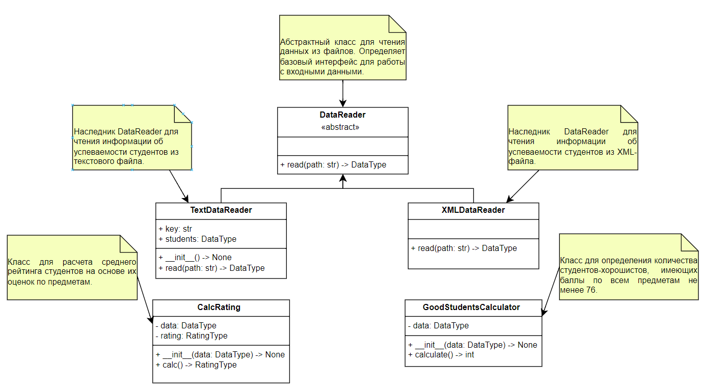

# Лабораторная 1 по дисциплине **"Технологии программирования и инструментальные средства разработки систем искусственного интеллекта"** (вариант №7)
---
## 1. Постановка задачи
В рамках лабораторной работы необходимо разработать и протестировать программный проект для обработки информации об успеваемости студентов.
Общая часть лабораторной работы предусматривает:
1. создание абстрактного класса `DataReader`;
2. реализацию чтения данных из текстового файла;
3. хранение информации о студентах в едином формате;
4. расчет рейтинга студентов;
5. написание модульных тестов;
6. настройку автоматической проверки кода и тестов с помощью GitHub Actions.

Для варианта №7 было необходимо:
1. добавить класс-наследник `DataReader`, предназначенный для обработки входного файла формата XML;
2. составить модульные тесты для нового класса;
3. добавить класс, рассчитывающий количество студентов-хорошистов;
4. составить модульные тесты для этого класса;
5. выполнить разработку индивидуальных частей в отдельных ветках Git;
6. после успешного прохождения всех тестов объединить изменения с главной веткой;
7. представить UML-диаграмму классов итогового проекта;
8. сформулировать выводы по результатам работы.

### Критерий хорошиста
Студент считается хорошистом, если **каждая его оценка по всем предметам удовлетворяет условию** ```оценка >= 76```:
- студент, имеющий оценки `80, 76, 91` - хорошист;
- а студент, у которого оценки `78, 87, 61` - не хорошист, так как одна оценка меньше 76.
---
## 2. Краткое описание проекта
Проект представляет собой небольшое приложение на Python для чтения и обработки данных об успеваемости студентов.

Для унификации работы с разными форматами входных данных используется абстрактный класс `DataReader`. На его основе реализованы два класса:

- `TextDataReader` - чтение данных из текстового файла;
- `XMLDataReader` - чтение данных из XML-файла.

Независимо от формата входного файла данные преобразуются к общему типу `DataType`:

```text
dict[str, list[tuple[str, int]]]
```

И для каждого студента хранится список пар:

```text
(название предмета, оценка)
```

После получения данных они могут передаваться в отдельные классы расчета характеристик:

- `CalcRating` - рассчитывает средний балл студентов;
- `GoodStudentsCalculator` - рассчитывает количество студентов, у которых все оценки не меньше 76.
---

## 3. Структура проекта

```text
rating/
│
├── .github/
│   └── workflows/
│       └── github-actions-testing.yml
│
├── data/
│   ├── data.txt
│   └── data.xml
│
├── src/
│   ├── __init__.py
│   ├── CalcRating.py
│   ├── DataReader.py
│   ├── GoodStudentsCalculator.py
│   ├── TextDataReader.py
│   ├── Types.py
│   ├── XMLDataReader.py
│   └── main.py
│
├── test/
│   ├── __init__.py
│   ├── test_CalcRating.py
│   ├── test_GoodStudentsCalculator.py
│   ├── test_TextDataReader.py
│   ├── test_XMLDataReader.py
│   └── test_main.py
│
├── .gitignore
├── LICENSE
├── README.md
└── requirements.txt
```
---
## 4. Реализованные классы

Реализованные классы и их описание представлено ниже на UML-диаграмме итогового проекта.



### 4.1. `DataReader`
---

`DataReader` - абстрактный базовый класс для чтения входных данных.

Он задает общий интерфейс:

```python
read(path: str) -> DataType
```

---

### 4.2. `TextDataReader`

`TextDataReader` - наследник `DataReader`, предназначенный для обработки исходного текстового формата.

Класс открывает файл, определяет студентов, считывает предметы, считывает оценки и формирует объект `DataType`.

---

### 4.3. `XMLDataReader`

`XMLDataReader` - второй наследник `DataReader` (реализован по варианту №7).

Класс выполняет открытие XML-файла, разбор XML-дерева, поиск элементов студентов, получение ФИО студента, получение названий предметов, преобразование оценок в целые числа, формирование общего объекта `DataType`.

---

### 4.4. `CalcRating`

`CalcRating` - класс, который принимает данные типа `DataType` и рассчитывает среднее арифметическое оценок каждого студента.

Результат имеет вид:

```text
dict[str, float]
```

где ключом является ФИО студента, а значением - его средний балл.

---

### 4.5. `GoodStudentsCalculator`

`GoodStudentsCalculator` - это класс, который реализует индивидуальное задание варианта №7

Основной метод:

```python
calculate() -> int
```

перебирает студентов и проверяет условие:

```python
all(score >= 76 for _, score in subjects)
```

Использование `all()` означает, что студент будет засчитан только в том случае, если условие выполняется для каждого предмета. Результатом является целое число - количество студентов-хорошистов.

---

## 5. Формат XML

Для индивидуального задания используется XML-файл с информацией о студентах.

Пример структуры:

```xml
<?xml version="1.0" encoding="UTF-8"?>
<root>
    <student name="Иванов Иван Иванович">
        <subject name="математика">67</subject>
        <subject name="литература">100</subject>
        <subject name="программирование">91</subject>
    </student>

    <student name="Петров Петр Петрович">
        <subject name="математика">78</subject>
        <subject name="химия">87</subject>
        <subject name="социология">99</subject>
    </student>
</root>
```

---

## 6. Используемые языки, библиотеки и технологии

### Язык программирования

- **Python 3.10**.

### Стандартные библиотеки Python

- `abc` - создание абстрактного класса `DataReader`;
- `argparse` - обработка аргументов командной строки;
- `sys` - получение аргументов командной строки;
- `xml.etree.ElementTree` - разбор XML-файлов.

### Сторонние библиотеки

- **pytest** - написание и запуск модульных тестов;
- **pycodestyle** - проверка соответствия исходного кода стандарту оформления PEP 8.

### Инструменты разработки

- **Visual Studio Code**;
- **Git**;
- **GitHub**;
- **GitHub Actions**;
- виртуальное окружение Python `venv`;
- `pip` для установки зависимостей.

---

## 7. Тестирование

Для проекта разработаны модульные тесты с использованием `pytest`. Тестами проверяется как общая часть лабораторной работы, так и функциональность индивидуального варианта №7.

### `test_CalcRating.py`

Проверяется:

- корректность передачи входных данных в `CalcRating`;
- правильность расчета среднего балла;
- расчет рейтинга для нескольких студентов;
- сравнение результатов с ожидаемыми значениями с использованием допустимой погрешности.

---

### `test_TextDataReader.py`

Проверяется:

- чтение текстового файла;
- распознавание нескольких студентов;
- корректное чтение нескольких предметов;
- преобразование оценок в целые числа;
- формирование ожидаемой структуры `DataType`.

Для тестирования файла используется временный каталог `tmpdir`, поэтому тест не зависит от наличия конкретного внешнего файла.

---

### `test_XMLDataReader.py`

Тесты разработаны специально для индивидуального задания.

Проверяется:

- корректное чтение XML-файла;
- корректное распознавание нескольких студентов;
- чтение нескольких предметов одного студента;
- корректное преобразование оценок;
- формирование словаря `DataType`;
- обработка XML, не содержащего студентов.

Также тестируется XML с одним студентом, что позволяет отдельно проверить базовую логику парсинга.

---

### `test_GoodStudentsCalculator.py`

Тесты покрывают основную логику индивидуального задания.

Проверяется:

1. корректный подсчет нескольких хорошистов;
2. исключение студентов, у которых хотя бы одна оценка меньше 76;
3. граничное значение `76`;
4. ситуация, когда хорошистов нет;
5. пустой набор данных.

Особенно важным является тест граничного значения:

```text
76 >= 76
```

Он подтверждает, что условие индивидуального задания реализовано именно как `>= 76`, а не как `> 76`.

---

### `test_main.py`

Проверяется обработка аргументов командной строки:

- корректное получение пути к входному файлу;
- обработка неправильных аргументов;
- возникновение `SystemExit` при некорректном вызове `argparse`.

---

## 8. Проверка качества кода

Для статической проверки оформления исходного кода используется `pycodestyle`.

Проверка запускается командой:

```powershell
pycodestyle src test
```

Для запуска всех тестов:

```powershell
pytest test
```

В GitHub Actions настроена автоматическая проверка проекта при отправке изменений в ветку `main`.

Workflow выполняет:

1. получение исходного кода репозитория;
2. установку Python;
3. установку зависимостей из `requirements.txt`;
4. проверку `pycodestyle`;
5. запуск `pytest`.

---

## 9. Выводы

В ходе выполнения лабораторной работы был разработан и протестирован программный проект для обработки данных об успеваемости студентов. В общей части проекта были реализованы абстрактный класс `DataReader`, чтение текстовых данных, расчет среднего рейтинга и модульное тестирование. В соответствии с индивидуальным вариантом №7 был реализован класс `XMLDataReader`, позволяющий получать данные о студентах из XML-файла и преобразовывать их к единому типу `DataType`. Также был разработан класс `GoodStudentsCalculator`, который определяет количество студентов-хорошистов. При проверке используется условие, согласно которому все оценки студента должны быть не меньше `76`. Для разработанных компонентов были составлены модульные тесты на `pytest`. Тесты проверяют корректные и граничные случаи, включая отсутствие хорошистов, пустые данные и оценку, равную `76`. В процессе выполнения индивидуального задания использовались отдельные ветки Git с последующим объединением изменений с главной веткой. Для автоматической проверки проекта настроен GitHub Actions, выполняющий проверку `pycodestyle` и запуск всех тестов. В результате была получена работоспособная программа с разделением ответственности между компонентами, единым интерфейсом чтения данных и автоматизированным тестированием. Работа позволила закрепить навыки объектно-ориентированного программирования, наследования, модульного тестирования, работы с XML, Git/GitHub и организации программного проекта.
